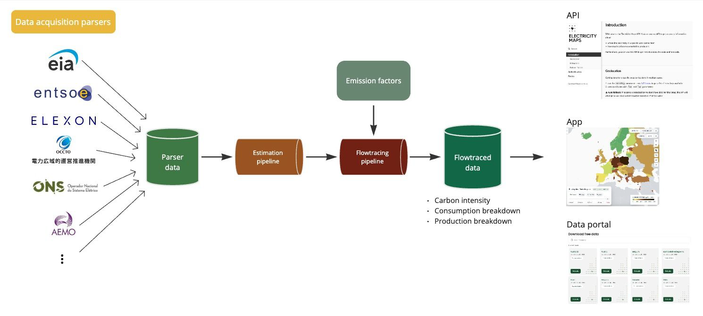

# 基础预测模型
碳排放因子预测模型：
**输入**：每个省的天气预报数据，模型参数提前训练好。
**输出**：风力发电的数据，预计碳排放因子
碳排放因子（Carbon Intensity），我们可以

## 参考模型
### E-Map的模型

EMap是一个欧洲的工具，完整的解决了预测问题
问题描述
碳强度（g CO2 eq/kWh）和电力构成
需要国家级别的数据
进行24小时/48小时的逐小时预测
不知道风电和光电的位置
实时观测数据可能会有数天或数周的延迟
实时数据可能只是一个估计值（在数月后仍会发生变化）
数据源可能会发生变化、消失或改变格式
解决方案应能够对所有区域进行泛化
解决方案应具有可扩展性

之前的方案
- 每个区域都有两个模型 (carbon intensity and power breakdown)
- 预测40个区域 训练80个模型
- Automatic feature selection using L1 regularization Lasso
- 3 to 6 months of historical data from publicly available data
- sources → 4300 features
- 模型每次都要重新训练 Models trained upon demand

问题：
- With + 4300 features, explainability is difficult to achieve - what contributes to carbon intensity?
- The system was independent of our main pipeline
- Quality metrics was not there and it is difficult to debug
- Completeness problems
- Difficult to evaluate

一个好的模型应该具有的特性：
- Interoperability with main pipeline
- 可解释性Models should be explainable
- Scalability
- Flexibility
- Completeness guarantees
- Improved performance for CI forecasts

模型尝试：
- 线性回归 L1-Lasso损失 
- Pros:
    - Feature selection
    - Handles multicollinearity
    - Avoids overfitting
    - Works well for tabular data
    - Computationally lightweight
- Cons:
    - Assumes linear relationships
    - Requires feature scaling
    - Canʼt handle missing values directly
- XGBoost

Tree-based models (xgboost, random forest)
- Pros:
    - Feature selection
        - (feature importance)
    - Handles missing values
    - Scalable to large datasets
    - Works well for tabular data
    - Can handle missing values
    - Computationally lightweight
- Cons:
    - Risk of overfitting

## 我们的模型

模型应该尽量简单，所用的feature也尽量少，这样我们训练/测试/部署/分享/分析模型会更方便。

## 基本参数：
时不变参数：
- 各省风电/光电装机总量  (Source: 报道，国际组织公开数据)
- 火力发电装机总量  (Source:报道，国际组织公开数据)

时变变量：
- 天气数据->光伏/风电利用率 （）
- 需求量预测

## 训练方法：
