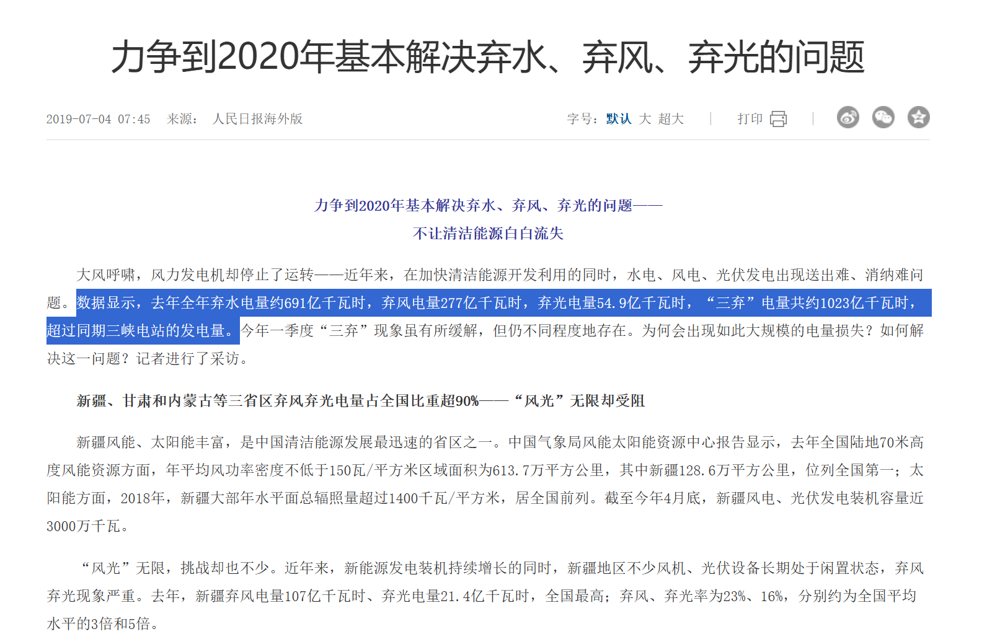
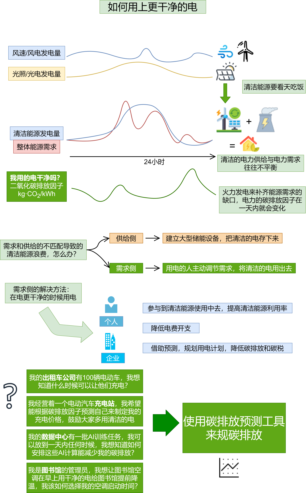
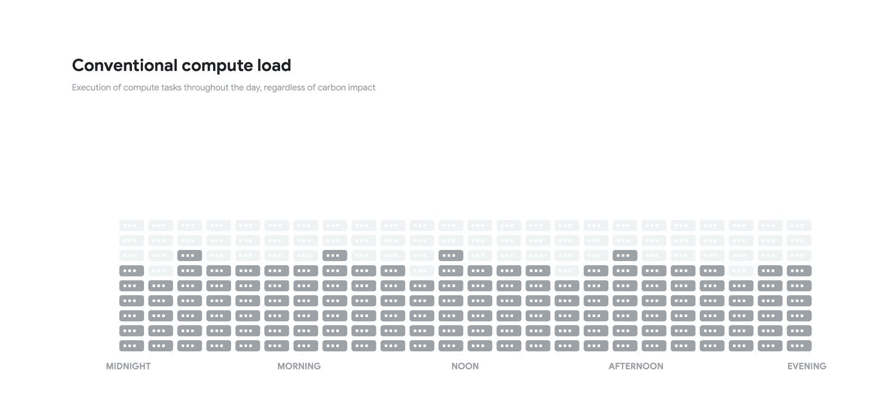
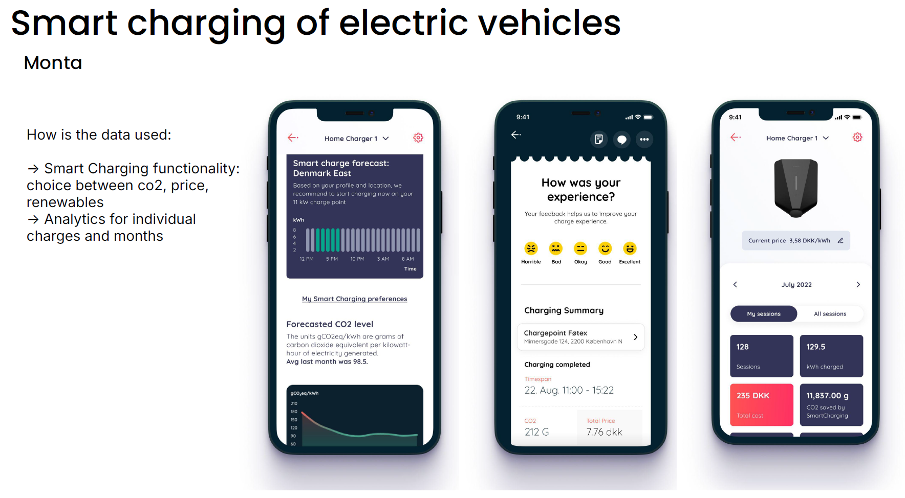

# Comm&Clear Energy Forecast 碳效预测
[TOC]

⚡你知道，在上海早上7点用电比12点相比，会减少2/3的二氧化碳排放吗？

📈我们是CCE Forecast-碳效预测，是一个关于预测未来清洁电能发电量和碳排放因子的开源网站/工具，为减碳行动提供信息与决策基础。让所有人参与进来，用上更干净的电。

> We provide means for action. 
> 碳效预测，让你掌控减碳的主动权。

## Our Mission 我们的使命

**问题与需求**：我们国家发出来的干净的电发出来，但是没有用上？

我们该怎么做？

💡使用碳排放预测工具通过**供需两侧**的协同努力，不光建设更多的储能站，更让市民与企业参与到减碳减排的活动中去，推动使用更干净的电能。

📈通过准确的预测和调度，减少化石燃料发电的需求，从而降低整体的碳排放量。碳效预测对于企业尤其是高能耗企业（如数据中心、新能源租车公司等）具有重要的经济和环保意义。

示例：谷歌计算和数据中心如何更好的利用清洁能源

示例：Monta公司的电动汽车充电设备帮助用户进行碳排放规划

电力需求有弹性的与非弹性的，如果让弹性的电力需求与清洁能源的供给相匹配，我们可以降低整体的碳排放，提升清洁能源投资的利用率和回报率，形成经济上的绿色循环♻️

## Reference 参考

[比利时 E-Map](https://app.electricitymaps.com/zone/BE)

[谷歌的数据中心的碳中和的努力-Our data centers now work harder when the sun shines and the wind blows](https://blog.google/inside-google/infrastructure/data-centers-work-harder-sun-shines-wind-blows/)

## License

为了支持减碳事业，代码完全开源

MIT License

Copyright (c) 2024 qcsui

Permission is hereby granted, free of charge, to any person obtaining a copy
of this software and associated documentation files (the "Software"), to deal
in the Software without restriction, including without limitation the rights
to use, copy, modify, merge, publish, distribute, sublicense, and/or sell
copies of the Software, and to permit persons to whom the Software is
furnished to do so, subject to the following conditions:

The above copyright notice and this permission notice shall be included in all
copies or substantial portions of the Software.

THE SOFTWARE IS PROVIDED "AS IS", WITHOUT WARRANTY OF ANY KIND, EXPRESS OR
IMPLIED, INCLUDING BUT NOT LIMITED TO THE WARRANTIES OF MERCHANTABILITY,
FITNESS FOR A PARTICULAR PURPOSE AND NONINFRINGEMENT. IN NO EVENT SHALL THE
AUTHORS OR COPYRIGHT HOLDERS BE LIABLE FOR ANY CLAIM, DAMAGES OR OTHER
LIABILITY, WHETHER IN AN ACTION OF CONTRACT, TORT OR OTHERWISE, ARISING FROM,
OUT OF OR IN CONNECTION WITH THE SOFTWARE OR THE USE OR OTHER DEALINGS IN THE
SOFTWARE.
